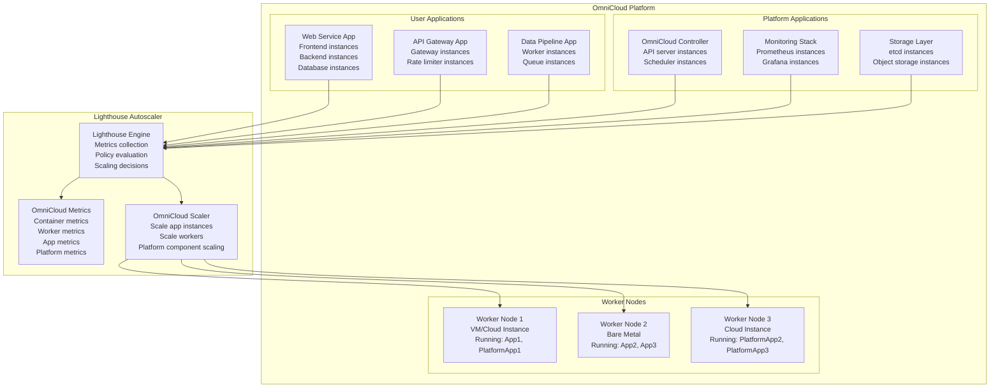
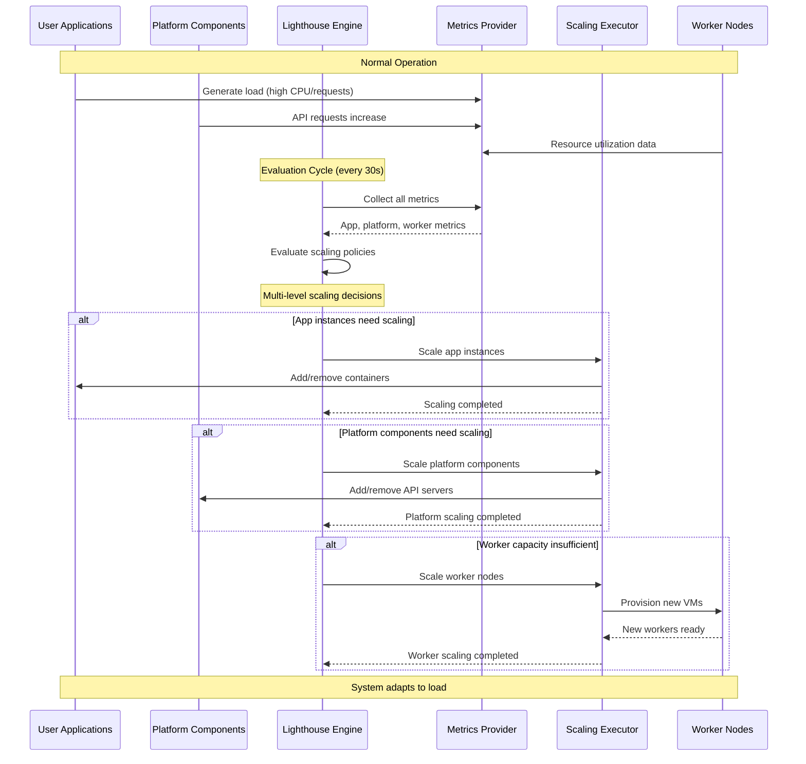
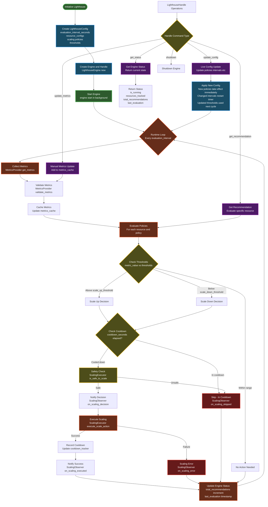

# OmniCloud Lighthouse Autoscaler Documentation

## Overview

The OmniCloud Lighthouse Autoscaler provides intelligent scaling capabilities for the OmniCloud platform. Built on the Lighthouse autoscaling library, it manages resource allocation across three distinct layers: application instances, worker nodes, and platform components.

OmniCloud operates on a distributed container orchestration model where applications run as collections of container instances across a fleet of worker nodes. The platform itself consists of core services that are treated as applications within the same scaling framework.



## Architecture

### The Three-Layer Scaling Model

The autoscaler operates across three interconnected layers, each with different scaling characteristics and requirements.

**Application Instance Scaling** handles the most granular level of resource management. When a user deploys an application to OmniCloud, it consists of one or more container instances running across the worker fleet. The autoscaler monitors application metrics like CPU usage, memory consumption, request rates, and custom business metrics to make scaling decisions. This layer provides the fastest response time, typically scaling within seconds to minutes.

**Worker Node Scaling** manages the underlying compute infrastructure. When existing workers reach capacity limits or when pending workloads cannot be scheduled, the autoscaler provisions additional worker nodes. These can be cloud instances, virtual machines, or bare metal servers depending on the deployment configuration. Worker scaling operates on a longer time horizon due to provisioning overhead.

**Platform Component Scaling** ensures the OmniCloud control plane remains responsive under varying loads. Components like the API server, scheduler, and storage services are themselves applications that can be scaled. The autoscaler applies conservative policies to these components since platform stability is critical.

### Application-Centric Design

In OmniCloud, everything runs as an application, including the platform's own components. A user's web service is an application containing frontend and backend instances. Similarly, the OmniCloud API server is an application containing API server instances. This unified model allows the same autoscaling engine to manage both user workloads and platform infrastructure.

User applications typically have aggressive scaling policies optimized for performance and cost efficiency. Platform components use conservative policies that prioritize stability and high availability over cost optimization.

## Implementation

### Metrics Collection

The OmniMetricsProvider integrates with OmniCloud's monitoring infrastructure to collect metrics across all three scaling layers. For application instances, it gathers container-level metrics from cAdvisor and application-specific metrics from custom exporters. Worker node metrics come from node exporters running on each worker. Platform component metrics are collected from each service's built-in monitoring endpoints.

```rust
#[async_trait]
impl MetricsProvider for OmniMetricsProvider {
    async fn get_metrics(&self, resource_id: &str, _context: &CallbackContext) -> LighthouseResult<Option<ResourceMetrics>> {
        let (resource_type, app_id, instance_id) = self.parse_resource_id(resource_id)?;
        
        match resource_type {
            "app_instance" => {
                let container_metrics = self.prometheus_client
                    .get_container_metrics(app_id, instance_id).await?;
                let app_metrics = self.get_app_specific_metrics(app_id).await?;
                Ok(Some(self.combine_metrics(container_metrics, app_metrics)))
            },
            "worker_node" => {
                let node_metrics = self.prometheus_client
                    .get_node_metrics(resource_id).await?;
                Ok(Some(node_metrics))
            },
            "platform_component" => {
                let component_metrics = self.get_platform_component_metrics(resource_id).await?;
                Ok(Some(component_metrics))
            },
            _ => Ok(None)
        }
    }
}
```

The metrics provider handles the complexity of different metric sources and normalizes them into a consistent format for the scaling engine. Custom metrics can be injected through the monitoring stack or directly via the autoscaler's API.

### Scaling Execution

The OmniScalingExecutor translates scaling decisions into concrete actions within the OmniCloud platform. For application instances, it interfaces with the container orchestrator to add or remove instances. Worker node scaling involves provisioning or terminating compute resources through cloud provider APIs or infrastructure management tools. Platform component scaling follows the same patterns as user applications but with additional safety checks.

```rust
#[async_trait]
impl ScalingExecutor for OmniScalingExecutor {
    async fn execute_scale_action(&self, action: &ScaleAction, _context: &CallbackContext) -> LighthouseResult<bool> {
        let (resource_type, app_id, _) = self.parse_resource_id(&action.resource_id)?;
        
        match resource_type {
            "app_instance" => {
                match action.direction {
                    ScaleDirection::Up => {
                        self.omnicloud_api.scale_app_instances(
                            app_id,
                            action.scale_factor.unwrap_or(1.5)
                        ).await?;
                    },
                    ScaleDirection::Down => {
                        self.omnicloud_api.scale_down_app_instances(
                            app_id,
                            action.scale_factor.unwrap_or(0.7)
                        ).await?;
                    },
                    ScaleDirection::Maintain => return Ok(false),
                }
            },
            "worker_node" => {
                match action.direction {
                    ScaleDirection::Up => {
                        self.worker_manager.provision_worker_node().await?;
                    },
                    ScaleDirection::Down => {
                        self.worker_manager.terminate_worker_node(&action.resource_id).await?;
                    },
                    ScaleDirection::Maintain => return Ok(false),
                }
            },
            "platform_component" => {
                self.scale_platform_component(app_id, action).await?;
            },
            _ => return Ok(false),
        }
        
        Ok(true)
    }
}
```

### Safety Mechanisms

The scaling executor implements several safety mechanisms to prevent dangerous scaling operations. Maintenance windows disable scaling during planned maintenance periods. Budget controls prevent runaway costs by monitoring spending rates and blocking scaling when limits are approached.

Platform components have special protections. The autoscaler will never scale platform components below the minimum required for high availability, regardless of low resource utilization. Similarly, worker nodes running critical platform workloads are protected from termination.

```rust
async fn is_safe_to_scale(&self, action: &ScaleAction, _context: &CallbackContext) -> LighthouseResult<bool> {
    if self.is_maintenance_window().await? {
        return Ok(false);
    }
    
    if !self.within_budget_limits(&action.resource_id).await? {
        return Ok(false);
    }
    
    if action.resource_id.starts_with("platform_component:") {
        if action.direction == ScaleDirection::Down {
            let current_instances = self.get_current_capacity(&action.resource_id, _context).await?;
            if current_instances.unwrap_or(0) <= 3 {
                return Ok(false);
            }
        }
    }
    
    Ok(true)
}
```

## Configuration

### Scaling Policies

Scaling policies define when and how to scale resources based on metric thresholds. Different resource types typically use different policy configurations optimized for their specific requirements.

User applications often use aggressive policies focused on performance metrics like request rate and response time. A typical web application might scale up when request rates exceed 1000 requests per second or when average response time exceeds 500 milliseconds.

```rust
let web_app_policy = ScalingPolicy {
    name: "request-rate-scaling".to_string(),
    thresholds: vec![ScalingThreshold {
        metric_name: "requests_per_second".to_string(),
        scale_up_threshold: 1000.0,
        scale_down_threshold: 200.0,
        scale_factor: 1.5,
        cooldown_seconds: 180,
    }],
    min_capacity: Some(3),
    max_capacity: Some(50),
    enabled: true,
};
```

Platform components use more conservative policies with longer cooldown periods to ensure stability. The API server might scale based on request queue length and response time percentiles, but with longer cooldown periods to prevent thrashing.

```rust
let platform_api_policy = ScalingPolicy {
    name: "platform-api-scaling".to_string(),
    thresholds: vec![ScalingThreshold {
        metric_name: "api_request_queue_length".to_string(),
        scale_up_threshold: 100.0,
        scale_down_threshold: 10.0,
        scale_factor: 1.3,
        cooldown_seconds: 600,
    }],
    min_capacity: Some(3),
    max_capacity: Some(12),
    enabled: true,
};
```

Worker node scaling operates on cluster-level metrics like overall CPU utilization and the count of pending workloads that cannot be scheduled. These policies have the longest cooldown periods since provisioning new workers is expensive.

```rust
let worker_node_policy = ScalingPolicy {
    name: "cluster-capacity-scaling".to_string(),
    thresholds: vec![ScalingThreshold {
        metric_name: "cluster_cpu_utilization".to_string(),
        scale_up_threshold: 80.0,
        scale_down_threshold: 40.0,
        scale_factor: 1.2,
        cooldown_seconds: 1800,
    }],
    min_capacity: Some(3),
    max_capacity: Some(100),
    enabled: true,
};
```

### Runtime Configuration Updates

The autoscaler supports live configuration updates without requiring restarts. Scaling policies, thresholds, and capacity limits can be modified through the management API and take effect on the next evaluation cycle. This capability is essential for tuning scaling behavior in production environments.

Configuration changes are validated before application to prevent invalid policies from disrupting scaling operations. The validation includes checking for reasonable threshold values, ensuring minimum capacity does not exceed maximum capacity, and verifying that cooldown periods are appropriate for the resource type.

## Runtime Operation

The autoscaler operates through coordinated interactions between user applications, platform components, and the scaling infrastructure. Understanding this flow is essential for troubleshooting and optimization.



During each evaluation cycle, the autoscaler collects metrics from all monitored resources, evaluates them against configured policies, and executes any necessary scaling actions. The sequence ensures that application scaling occurs before worker scaling, preventing unnecessary infrastructure provisioning when existing capacity can handle the load.

## Monitoring and Observability

### Metrics and Alerting

The autoscaler exposes comprehensive metrics about its operation, including the number of scaling decisions, success rates, and resource counts across different categories. These metrics integrate with standard monitoring stacks like Prometheus and Grafana.

Key metrics include scaling event counters broken down by resource type and direction, current resource counts for applications and workers, and cost metrics when integrated with cloud provider billing APIs. Response time metrics track how quickly the autoscaler responds to threshold breaches.

Alert rules can be configured to notify operators of significant scaling events, budget threshold approaches, or autoscaler component failures. Platform component scaling events warrant immediate attention since they may indicate unusual load patterns or infrastructure issues.

### Performance Characteristics

The autoscaler's evaluation cycle runs at configurable intervals, typically every 30 seconds for production deployments. Each evaluation cycle processes all monitored resources and their associated policies following a structured decision flow.



The evaluation time scales linearly with the number of resources and policies. Each policy evaluation involves metric threshold comparisons and cooldown checks, which are constant-time operations. The most expensive operations are metrics collection and scaling action execution, which occur asynchronously to prevent blocking the evaluation cycle.

Scaling actions are executed asynchronously to prevent blocking the evaluation cycle. Failed scaling actions are retried with exponential backoff. The autoscaler maintains state about recent scaling actions to enforce cooldown periods and prevent oscillating behavior.

Memory usage scales with the number of monitored resources and the configured history retention period for metrics. A typical deployment monitoring 1000 applications with standard metric retention uses approximately 100MB of memory.

## Integration

### Custom Metrics

Applications can expose custom business metrics through standard monitoring interfaces or by directly sending metrics to the autoscaler. Business metrics like active user counts, transaction rates, or revenue figures often provide better scaling signals than infrastructure metrics alone.

Custom metrics are treated identically to system metrics in scaling policies. A e-commerce application might scale based on orders per minute during peak shopping periods, providing more responsive scaling than CPU-based policies.

```rust
handle.update_metrics(utils::business_metrics(
    "e-commerce-app",
    vec![
        ("orders_per_minute", 125.0),
        ("revenue_per_hour", 15000.0),
        ("cart_abandonment_rate", 0.23),
    ]
)).await?;
```

### API Integration

The autoscaler provides REST and gRPC APIs for integration with external systems. The metrics API accepts time-series data in multiple formats. The configuration API supports CRUD operations on scaling policies and resource configurations.

Authentication and authorization integrate with OmniCloud's identity system. Different permission levels control access to configuration changes, metrics submission, and scaling overrides. Audit logging tracks all API interactions for compliance and debugging.

## Deployment

### Prerequisites

The autoscaler requires access to the OmniCloud API for executing scaling actions and to the monitoring infrastructure for metrics collection. Network connectivity to worker nodes is needed for node-level metric collection and health checks.

Database access may be required for persistent configuration storage and audit logging, depending on the deployment configuration. Cloud provider credentials are necessary for worker node provisioning in cloud deployments.

### Configuration Management

Production deployments typically store configuration in version-controlled YAML files that are applied through the configuration API. This approach enables change tracking and rollback capabilities. Configuration can also be managed through infrastructure-as-code tools like Terraform or Ansible.

Environment-specific configurations handle differences between development, staging, and production deployments. Scaling policies often use more aggressive settings in development environments and conservative settings in production.

The autoscaler validates configuration changes before applying them and maintains a history of configuration versions. Rollback capabilities allow reverting to previous configurations if new policies cause unexpected behavior.

## Advanced Topics

### Predictive Scaling

The autoscaler can integrate with machine learning models to implement predictive scaling based on historical patterns. Instead of reacting to current metric values, predictive scaling anticipates future load based on time-of-day patterns, seasonal trends, or external factors.

Predictive models are typically deployed as separate services that feed predictions into the autoscaler as custom metrics. The autoscaler treats predicted values identically to observed metrics when evaluating scaling policies.

### Multi-Cloud Worker Management

In multi-cloud deployments, worker node scaling considers factors beyond simple capacity needs. Cost optimization policies might prefer cheaper cloud providers when performance requirements permit. Geographic distribution requirements might mandate worker placement in specific regions.

The worker manager component abstracts cloud provider differences and implements placement policies. Scaling decisions include both the number of workers needed and their optimal placement across available providers and regions.

### Cost Optimization

The autoscaler integrates with Omni's cost optimization module, which itself integrates with compatible CPIs to implement cost-aware scaling policies. Real-time cost tracking prevents budget overruns by blocking expensive scaling actions when spending rates exceed configured limits.

Cost optimization features include preferential scaling of cheaper resource types, automatic termination of idle resources, and integration with spot instance markets for workloads that can tolerate interruptions.